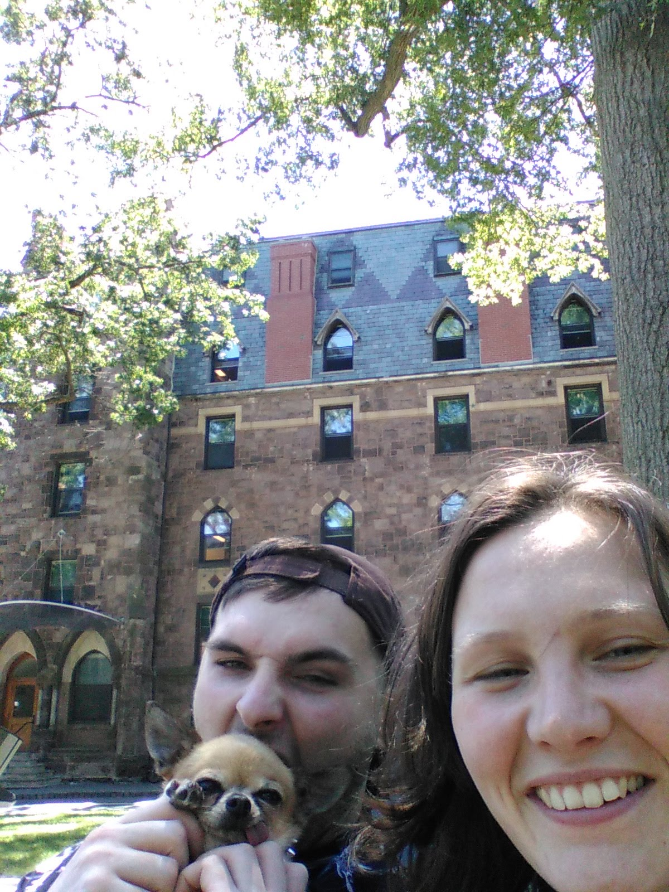
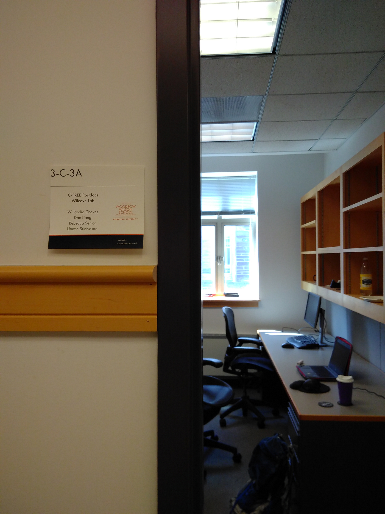
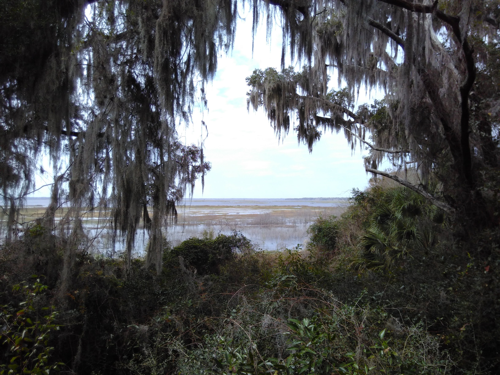

I've been a bit quiet since my first post because it's been a time of lots of exciting news and change!

In the last couple of weeks I've moved to Princeton University in the United States to take up a position as a Postdoctoral Research Associate in the Center for Policy Research on Energy and the Environment (C-PREE), working with Prof David Wilcove. The project is all about using data from the [IUCN Red List of Threatened Species](https://www.iucnredlist.org/) to understand which conservation actions have been successful in recovering threatened species. It's a change of topic for me so I have a lot to learn, but you can be sure I'll be crowbarring `R` in wherever I can -- in data collation, processing and analysis etc.

In other news, the final two papers from my PhD have now been accepted for publication and I look forward to sharing them when I can. One describes an `R` package called `ThermStats` that can already be accessed from my [GitHub page](https://github.com/rasenior/ThermStats) or directly installed in `R` using `devtools::install_github("rasenior/ThermStats")`. This package is intended to simplify the processing and analysis of gridded temperature data in `R`, particularly for ecological applications. I welcome feedback on the package, which can be submitted [here](https://github.com/rasenior/ThermStats/issues). I will give a brief overview of `ThermStats` in a separate post once the paper is available.

Earlier this year I was also priviliged to spend a couple of months at the University of Florida visiting [Dr Brett Scheffers](https://wec.ifas.ufl.edu/people/wec-faculty/brett-scheffers/). Together with Dr Brunno Oliveira at Auburn University (USA) and collaborators at Massey University (New Zealand), we are investigating the global distribution of colourful passerines (songbirds). This work is ongoing so watch this space for updates, which of course will be exceptionally colourful and made in `R`.

